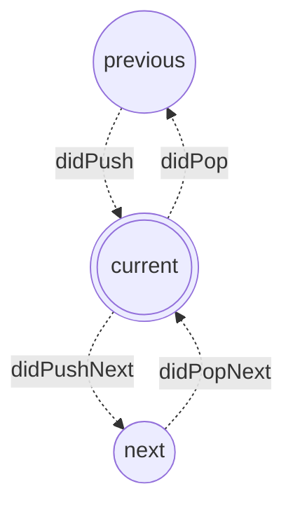

# useRouteAware

Flutter hooksを使用して画面遷移を検知する方法

[ここ](https://github.com/rrousselGit/flutter_hooks/issues/166)を参考に実装

## 使い方
- flutter_hooksをインストール
- RouteObserverをグローバルに定義
    ~~~
    final routeObserver = RouteObserver<PageRoute<dynamic>>();
    ~~~
- MaterialAppにRouteObserverを設定
    ~~~
    return MaterialApp(
      …
      navigatorObservers: [routeObserver],
      …
    );
    ~~~
- 検知したい画面に実装
    ~~~
    class RouteAwareSample extends HookWidget {
        const RouteAwareSample({super.key});

        @override
        Widget build(BuildContext context) {
            useRouteAware(
                routeObserver,
                didPush: () async {
                    debugPrint('didPush');
                },
                didPushNext: () async {
                    debugPrint('didPushNext');
                },
                didPopNext: () async {
                    debugPrint('didPopNext');
                },
                didPop: () async {
                    debugPrint('diddPop');
                },
            );

            return Scaffold(body: Container());
        }
    }

    ~~~

